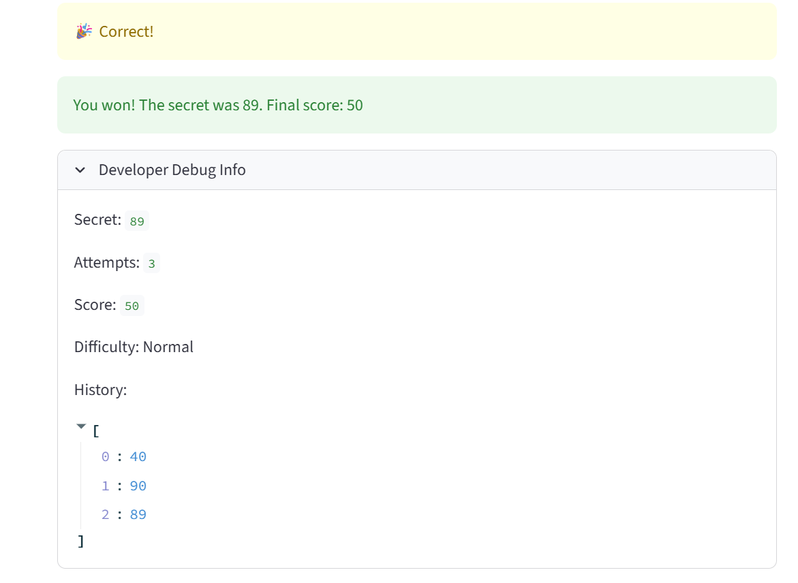

# 🎮 Game Glitch Investigator: The Impossible Guesser

## 🚨 The Situation

You asked an AI to build a simple "Number Guessing Game" using Streamlit.
It wrote the code, ran away, and now the game is unplayable. 

- You can't win.
- The hints lie to you.
- The secret number seems to have commitment issues.

## 🛠️ Setup

1. Install dependencies: `pip install -r requirements.txt`
2. Run the broken app: `python -m streamlit run app.py`

## 🕵️‍♂️ Your Mission

1. **Play the game.** Open the "Developer Debug Info" tab in the app to see the secret number. Try to win.
2. **Find the State Bug.** Why does the secret number change every time you click "Submit"? Ask ChatGPT: *"How do I keep a variable from resetting in Streamlit when I click a button?"*
3. **Fix the Logic.** The hints ("Higher/Lower") are wrong. Fix them.
4. **Refactor & Test.** - Move the logic into `logic_utils.py`.
   - Run `pytest` in your terminal.
   - Keep fixing until all tests pass!

## 📝 Document Your Experience

- [x] **Game purpose:** A number guessing game where the player tries to guess a secret number within a set number of attempts. The difficulty setting controls the range and attempt limit. Each wrong guess deducts points; winning awards points based on how quickly you guessed.

- [x] **Bugs found:**
  1. New Game button did not reset the game after a win or loss — the game stayed frozen and new guesses were not registered
  2. Hint direction was reversed — guessing too high showed "Go HIGHER" and guessing too low showed "Go LOWER"
  3. Switching difficulty did not update the displayed guess range — it was hardcoded to "1 and 100"
  4. Attempt counter started at 1 instead of 0, making it always 1 ahead of reality
  5. Score increased by 5 on even-numbered wrong guesses instead of always subtracting
  6. Developer debug panel showed stale values from the previous turn instead of the current one

- [x] **Fixes applied:**
  1. Added `status = "playing"` and `history = []` resets to the New Game block so the game fully restarts
  2. Swapped the hint messages in `check_guess` so Too High says "Go LOWER" and Too Low says "Go HIGHER"
  3. Replaced hardcoded `"1 and 100"` in the info banner with dynamic `{low}` and `{high}` variables
  4. Changed the initial value of `attempts` from `1` to `0`
  5. Removed the even/odd condition in `update_score` so wrong guesses always subtract 5 points
  6. Moved the Developer Debug Info expander to after the submit logic so it reflects the current turn

## 📸 Demo

## 🚀 Stretch Features

- [ ] [If you choose to complete Challenge 4, insert a screenshot of your Enhanced Game UI here]
